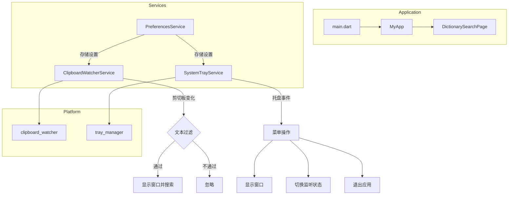

# 桌面端剪切板监听功能实现计划

## 功能概述

为 EasyDict 桌面端添加剪切板监听功能，用户复制文本后自动弹出软件窗口并执行查词。同时添加系统托盘功能，支持应用最小化到托盘运行。

## 需求确认

| 需求项   | 确认结果                       |
| -------- | ------------------------------ |
| 触发行为 | 直接弹出主窗口并自动搜索       |
| 应用状态 | 最小化到系统托盘运行           |
| 文本过滤 | 最小2字符，排除无效文本        |
| 托盘图标 | 使用应用默认图标               |
| 托盘菜单 | 显示窗口、剪切板监听开关、退出 |
| 设置开关 | 设置页面需要开关选项           |

## 技术方案

### 依赖包选择

推荐使用以下 Flutter 包：

1. **clipboard_watcher** - 监听系统剪切板变化
    - 支持 Windows、macOS、Linux
    - 地址：https://pub.dev/packages/clipboard_watcher

2. **tray_manager** - 系统托盘管理
    - 支持 Windows、macOS、Linux
    - 与 window_manager 同一作者，API 风格一致
    - 地址：https://pub.dev/packages/tray_manager

3. **super_clipboard** - 剪切板内容读取（可选）
    - 用于读取剪切板文本内容
    - 地址：https://pub.dev/packages/super_clipboard

### 架构设计



### 文件结构

```
lib/
├── services/
│   ├── clipboard_watcher_service.dart  # 新增：剪切板监听服务
│   ├── system_tray_service.dart        # 新增：系统托盘服务
│   └── preferences_service.dart        # 修改：添加设置项
├── pages/
│   └── settings_page.dart              # 修改：添加设置开关
├── main.dart                           # 修改：集成服务
└── i18n/
    ├── en.i18n.json                    # 修改：添加英文文本
    └── zh.i18n.json                    # 修改：添加中文文本
```

## 详细实现步骤

### 步骤 1：添加依赖包

在 `pubspec.yaml` 中添加：

```yaml
dependencies:
    # ... 现有依赖
    clipboard_watcher: ^0.2.1
    tray_manager: ^0.2.3
```

### 步骤 2：创建剪切板监听服务

创建 `lib/services/clipboard_watcher_service.dart`：

```dart
class ClipboardWatcherService with WindowListener {
  // 单例模式
  static final ClipboardWatcherService _instance = ClipboardWatcherService._internal();
  factory ClipboardWatcherService() => _instance;
  ClipboardWatcherService._internal();

  // 状态
  bool _isEnabled = false;
  bool _isWatching = false;
  String? _lastClipboardText;

  // 配置
  static const int minTextLength = 2;
  static const int maxTextLength = 1000;

  // 方法
  Future<void> initialize();
  Future<void> startWatching();
  Future<void> stopWatching();
  void _onClipboardChanged();
  bool _shouldProcessText(String text);
  Future<void> _searchText(String text);
}
```

**核心功能：**

- 监听剪切板变化事件
- 文本过滤逻辑（长度、空白字符等）
- 防重复处理（记录上次文本）
- 触发窗口显示和搜索

### 步骤 3：创建系统托盘服务

创建 `lib/services/system_tray_service.dart`：

```dart
class SystemTrayService with TrayListener {
  // 单例模式
  static final SystemTrayService _instance = SystemTrayService._internal();
  factory SystemTrayService() => _instance;
  SystemTrayService._internal();

  // 状态
  bool _isInitialized = false;

  // 方法
  Future<void> initialize();
  Future<void> updateMenu({required bool clipboardWatchEnabled});
  Future<void> showWindow();
  Future<void> hideWindow();
  void _onTrayIconMouseDown();
  void _onTrayIconRightMouseDown();
  void _onMenuItemClick(String menuItemId);
}
```

**托盘菜单结构：**

```
📋 EasyDict
├── 显示窗口
├── ──────────
├── ✓ 剪切板监听
└── 退出
```

### 步骤 4：修改 PreferencesService

在 `lib/services/preferences_service.dart` 中添加：

```dart
// 新增常量
static const String _kClipboardWatchEnabled = 'clipboard_watch_enabled';
static const String _kMinimizeToTray = 'minimize_to_tray';

// 新增方法
Future<bool> isClipboardWatchEnabled() async {
  final p = await prefs;
  return p.getBool(_kClipboardWatchEnabled) ?? false;
}

Future<void> setClipboardWatchEnabled(bool enabled) async {
  final p = await prefs;
  await p.setBool(_kClipboardWatchEnabled, enabled);
}

Future<bool> shouldMinimizeToTray() async {
  final p = await prefs;
  return p.getBool(_kMinimizeToTray) ?? true;
}

Future<void> setMinimizeToTray(bool value) async {
  final p = await prefs;
  await p.setBool(_kMinimizeToTray, value);
}
```

### 步骤 5：修改设置页面

在 `lib/pages/settings_page.dart` 中添加设置项：

```dart
// 在设置列表中添加
_buildSettingsTile(
  context,
  title: context.t.settings.clipboardWatch,
  subtitle: _clipboardWatchEnabled
    ? context.t.settings.clipboardWatchEnabled
    : context.t.settings.clipboardWatchDisabled,
  icon: Icons.content_paste,
  iconColor: colorScheme.primary,
  trailing: Switch(
    value: _clipboardWatchEnabled,
    onChanged: (value) async {
      await _preferencesService.setClipboardWatchEnabled(value);
      setState(() => _clipboardWatchEnabled = value);
      // 通知服务更新状态
      ClipboardWatcherService().setEnabled(value);
    },
  ),
),
```

### 步骤 6：修改主应用入口

在 `lib/main.dart` 中集成服务：

```dart
// 在 main() 函数中添加初始化
if (Platform.isWindows || Platform.isMacOS || Platform.isLinux) {
  // 初始化系统托盘
  await SystemTrayService().initialize();

  // 初始化剪切板监听
  await ClipboardWatcherService().initialize();

  // 根据设置启动监听
  final prefsService = PreferencesService();
  if (await prefsService.isClipboardWatchEnabled()) {
    ClipboardWatcherService().startWatching();
  }
}

// 修改窗口关闭行为
@override
void onWindowClose() async {
  final prefs = PreferencesService();
  if (await prefs.shouldMinimizeToTray()) {
    // 最小化到托盘而不是关闭
    await windowManager.hide();
  } else {
    // 正常关闭
    await windowManager.destroy();
  }
}
```

### 步骤 7：添加国际化文本

在 `lib/i18n/zh.i18n.json` 中添加：

```json
{
    "settings": {
        "clipboardWatch": "剪切板监听",
        "clipboardWatchEnabled": "已开启，复制文本后自动查词",
        "clipboardWatchDisabled": "已关闭",
        "minimizeToTray": "最小化到托盘"
    },
    "tray": {
        "showWindow": "显示窗口",
        "clipboardWatch": "剪切板监听",
        "exit": "退出"
    }
}
```

在 `lib/i18n/en.i18n.json` 中添加：

```json
{
    "settings": {
        "clipboardWatch": "Clipboard Watch",
        "clipboardWatchEnabled": "Enabled, auto-search when copying text",
        "clipboardWatchDisabled": "Disabled",
        "minimizeToTray": "Minimize to Tray"
    },
    "tray": {
        "showWindow": "Show Window",
        "clipboardWatch": "Clipboard Watch",
        "exit": "Exit"
    }
}
```

## 文本过滤规则

```dart
bool _shouldProcessText(String text) {
  // 1. 去除首尾空白
  text = text.trim();

  // 2. 长度检查
  if (text.length < minTextLength) return false;
  if (text.length > maxTextLength) return false;

  // 3. 排除纯空白
  if (text.isEmpty) return false;

  // 4. 排除纯数字
  if (RegExp(r'^\d+$').hasMatch(text)) return false;

  // 5. 排除重复文本（与上次相同）
  if (text == _lastClipboardText) return false;

  return true;
}
```

## 平台特定配置

### Windows

无需额外配置，clipboard_watcher 和 tray_manager 已内置支持。

### macOS

需要在 `macos/Runner/Info.plist` 中添加：

```xml
<key>LSUIElement</key>
<false/>
```

### Linux

需要确保系统支持系统托盘（大多数桌面环境已支持）。

## 注意事项

1. **权限问题**：macOS 可能需要额外的辅助功能权限来监听剪切板
2. **性能考虑**：剪切板监听应该是轻量级的，避免频繁触发搜索
3. **用户体验**：提供明确的开关选项，让用户可以控制此功能
4. **错误处理**：处理剪切板访问失败的情况

## 测试计划

1. **功能测试**
    - 开启/关闭剪切板监听
    - 复制不同类型文本（短文本、长文本、纯数字、空白）
    - 托盘菜单操作
    - 窗口显示/隐藏

2. **边界测试**
    - 应用最小化时复制
    - 应用完全隐藏时复制
    - 快速连续复制

3. **跨平台测试**
    - Windows 10/11
    - macOS
    - Linux（Ubuntu/Fedora）

## 风险评估

| 风险                                | 影响 | 缓解措施             |
| ----------------------------------- | ---- | -------------------- |
| 剪切板监听可能被系统限制            | 中   | 提供手动触发备选方案 |
| 托盘图标在某些 Linux 桌面环境不显示 | 低   | 文档说明兼容性       |
| 频繁触发影响性能                    | 中   | 添加防抖机制         |

## 后续优化

1. 添加自定义过滤规则（用户可配置）
2. 添加剪切板历史记录功能
3. 支持快捷键触发查词
4. 添加悬浮窗预览模式
