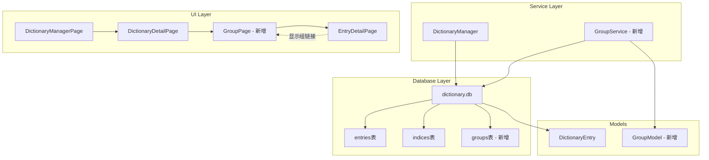

# Groups 表实现计划

## 概述

为 dictionary.db 添加可选的 `groups` 表，用于组织词条分组功能。每个组可以包含完整的词条或词条的特定部分（通过 anchor 定位）。

## 数据库设计

### groups 表结构

```sql
CREATE TABLE groups (
    group_id INTEGER PRIMARY KEY,
    parent_id INTEGER,                   -- 父级组ID，实现无限层级嵌套。NULL表示根目录
    name TEXT NOT NULL,                  -- 组名
    description TEXT,                    -- 组的描述，JSON格式（使用与entry相同的渲染方式）

    -- 组内项目列表（只存指针，不存具体文本）
    -- 格式：JSON数组 [{"e": 212, "a": ""}, {"e": 215, "a": "sense_group.0.sense.1"}]
    -- "e" = entry_id, "a" = anchor (JSON Path锚点，为空表示收录整个词条)
    item_list TEXT DEFAULT '[]',

    -- 预计算统计字段（空间换时间，避免移动端实时统计）
    sub_group_count INTEGER DEFAULT 0,   -- 包含的直接子组数量
    item_count INTEGER DEFAULT 0,        -- item_list数组的length

    FOREIGN KEY (parent_id) REFERENCES groups(group_id) ON DELETE CASCADE
);

CREATE INDEX idx_groups_parent ON groups(parent_id);
```

### 数据模型

```dart
// lib/data/models/group_model.dart

/// 组内项目
class GroupItem {
  final int entryId;
  final String? anchor;  // JSON Path锚点，为空表示整个词条

  GroupItem({required this.entryId, this.anchor});

  factory GroupItem.fromJson(Map<String, dynamic> json) {
    return GroupItem(
      entryId: json['e'] as int,
      anchor: json['a'] as String?,
    );
  }

  Map<String, dynamic> toJson() => {
    'e': entryId,
    if (anchor != null && anchor!.isNotEmpty) 'a': anchor,
  };
}

/// 组模型
class DictionaryGroup {
  final int? groupId;
  final int? parentId;
  final String name;
  final String? description;  // JSON字符串
  final List<GroupItem> itemList;
  final int subGroupCount;
  final int itemCount;

  DictionaryGroup({
    this.groupId,
    this.parentId,
    required this.name,
    this.description,
    this.itemList = const [],
    this.subGroupCount = 0,
    this.itemCount = 0,
  });

  factory DictionaryGroup.fromMap(Map<String, dynamic> map) {
    final itemListJson = map['item_list'] as String? ?? '[]';
    final itemList = (jsonDecode(itemListJson) as List)
        .map((e) => GroupItem.fromJson(e))
        .toList();

    return DictionaryGroup(
      groupId: map['group_id'] as int?,
      parentId: map['parent_id'] as int?,
      name: map['name'] as String,
      description: map['description'] as String?,
      itemList: itemList,
      subGroupCount: map['sub_group_count'] as int? ?? 0,
      itemCount: map['item_count'] as int? ?? 0,
    );
  }

  Map<String, dynamic> toMap() {
    final itemListJson = jsonEncode(itemList.map((e) => e.toJson()).toList());
    return {
      if (groupId != null) 'group_id': groupId,
      'parent_id': parentId,
      'name': name,
      'description': description,
      'item_list': itemListJson,
      'sub_group_count': subGroupCount,
      'item_count': itemList.length,
    };
  }
}
```

## 架构设计



## 实现步骤

### 1. 数据模型层 (lib/data/models/group_model.dart)

创建组相关的数据模型：

- `GroupItem`: 组内项目模型
- `DictionaryGroup`: 组模型

### 2. 数据库服务层 (lib/services/group_service.dart)

创建组服务类，提供 CRUD 操作：

```dart
class GroupService {
  /// 检查词典是否支持groups表
  Future<bool> hasGroupsTable(String dictId);

  /// 获取所有根组
  Future<List<DictionaryGroup>> getRootGroups(String dictId);

  /// 获取子组
  Future<List<DictionaryGroup>> getSubGroups(String dictId, int parentId);

  /// 获取组详情
  Future<DictionaryGroup?> getGroup(String dictId, int groupId);

  /// 获取组层级路径（用于面包屑）
  Future<List<DictionaryGroup>> getGroupPath(String dictId, int groupId);

  /// 查找entry所属的组
  Future<List<DictionaryGroup>> findGroupsByEntryId(String dictId, int entryId);

  /// 创建组
  Future<int> createGroup(String dictId, DictionaryGroup group);

  /// 更新组
  Future<void> updateGroup(String dictId, DictionaryGroup group);

  /// 删除组
  Future<void> deleteGroup(String dictId, int groupId);

  /// 添加项目到组
  Future<void> addItemsToGroup(String dictId, int groupId, List<GroupItem> items);

  /// 从组中移除项目
  Future<void> removeItemsFromGroup(String dictId, int groupId, List<GroupItem> items);

  /// 更新统计字段
  Future<void> updateGroupStats(String dictId, int groupId);
}
```

### 3. 组管理 UI

#### 3.1 词典详情页添加入口

在 `DictionaryDetailPage` 中添加"管理组"按钮，点击后进入组管理页面。

#### 3.2 组管理页面 (GroupManagePage)

- 显示组的树形结构
- 支持创建、编辑、删除组
- 支持拖拽排序

#### 3.3 组详情页面 (GroupPage)

显示：

- 组名称
- 组描述（使用 ComponentRenderer 渲染）
- 子组列表
- 词条列表（点击可在当前词典内跳转）

### 4. 词条内组链接显示

#### 4.1 EntryDetailPage 修改

在 `EntryDetailPage` 中：

- 加载当前 entry 所属的组信息
- 如果 entry 属于某个组，在顶部显示面包屑导航
- 如果 entry 的某部分（通过 anchor）属于组，在相应位置显示组链接

#### 4.2 ComponentRenderer 修改

在渲染组件时：

- 检查当前路径是否匹配某个组的 anchor
- 如果匹配，渲染组链接组件

### 5. 词条切换功能

实现不关闭页面的词条切换：

```dart
// 在 EntryDetailPage 中添加方法
void navigateToEntry(int entryId, {String? anchor}) {
  // 1. 从当前词典加载词条
  // 2. 更新 _entryGroup 状态
  // 3. 如果有 anchor，滚动到对应位置
  // 4. 触发 setState 重建 UI
}
```

### 6. 数据库迁移

#### 6.1 Python 工具更新 (auxi_tools/build_db_from_jsonl.py)

添加创建 groups 表的逻辑：

```python
def create_groups_table(cursor):
    cursor.execute('''
        CREATE TABLE IF NOT EXISTS groups (
            group_id INTEGER PRIMARY KEY,
            parent_id INTEGER,
            name TEXT NOT NULL,
            description TEXT,
            item_list TEXT DEFAULT '[]',
            sub_group_count INTEGER DEFAULT 0,
            item_count INTEGER DEFAULT 0,
            FOREIGN KEY (parent_id) REFERENCES groups(group_id) ON DELETE CASCADE
        )
    ''')
    cursor.execute('CREATE INDEX IF NOT EXISTS idx_groups_parent ON groups(parent_id)')
```

#### 6.2 Flutter 端兼容性检查

在打开词典数据库时，检查是否存在 groups 表：

```dart
Future<bool> hasGroupsTable(Database db) async {
  final result = await db.rawQuery(
    "SELECT name FROM sqlite_master WHERE type='table' AND name='groups'"
  );
  return result.isNotEmpty;
}
```

### 7. 国际化

在 `lib/i18n/zh.i18n.json` 和 `lib/i18n/en.i18n.json` 中添加：

```json
{
    "groups": {
        "title": "组管理",
        "manageGroups": "管理组",
        "createGroup": "创建组",
        "editGroup": "编辑组",
        "deleteGroup": "删除组",
        "groupName": "组名",
        "description": "描述",
        "subGroups": "子组",
        "entries": "词条",
        "noGroups": "暂无组",
        "belongsTo": "属于",
        "breadcrumb": "面包屑导航"
    }
}
```

## 关键技术点

### 1. Anchor 匹配逻辑

复用现有的 anchor 机制：

- `matchedAnchors` 存储匹配的锚点信息
- `_scrollToElement` 实现滚动到锚点
- `EntryEventBus` 发送滚动事件

### 2. 组链接渲染

在 ComponentRenderer 中添加组链接组件：

```dart
Widget _buildGroupLink(DictionaryGroup group, String anchor) {
  return InkWell(
    onTap: () => _navigateToGroup(group),
    child: Container(
      padding: EdgeInsets.symmetric(horizontal: 8, vertical: 4),
      decoration: BoxDecoration(
        color: colorScheme.primaryContainer,
        borderRadius: BorderRadius.circular(4),
      ),
      child: Row(
        mainAxisSize: MainAxisSize.min,
        children: [
          Icon(Icons.folder, size: 14),
          SizedBox(width: 4),
          Text(group.name, style: textStyle),
        ],
      ),
    ),
  );
}
```

### 3. 面包屑导航

```dart
Widget _buildBreadcrumb(List<DictionaryGroup> path) {
  return Wrap(
    spacing: 4,
    children: [
      for (int i = 0; i < path.length; i++) ...[
        if (i > 0) Icon(Icons.chevron_right, size: 16),
        InkWell(
          onTap: () => _navigateToGroup(path[i]),
          child: Text(path[i].name),
        ),
      ],
    ],
  );
}
```

## 文件清单

### 新增文件

| 文件路径                            | 说明           |
| ----------------------------------- | -------------- |
| `lib/data/models/group_model.dart`  | 组数据模型     |
| `lib/services/group_service.dart`   | 组服务层       |
| `lib/pages/group_page.dart`         | 组详情页面     |
| `lib/pages/group_manage_page.dart`  | 组管理页面     |
| `lib/widgets/group_breadcrumb.dart` | 面包屑导航组件 |
| `lib/widgets/group_link.dart`       | 组链接组件     |

### 修改文件

| 文件路径                                 | 修改内容                     |
| ---------------------------------------- | ---------------------------- |
| `lib/pages/dictionary_manager_page.dart` | 在词典详情页添加组管理入口   |
| `lib/pages/entry_detail_page.dart`       | 添加面包屑导航和词条切换功能 |
| `lib/components/component_renderer.dart` | 添加组链接渲染               |
| `lib/services/dictionary_manager.dart`   | 添加 groups 表检查方法       |
| `auxi_tools/build_db_from_jsonl.py`      | 添加 groups 表创建逻辑       |
| `lib/i18n/zh.i18n.json`                  | 添加中文国际化字符串         |
| `lib/i18n/en.i18n.json`                  | 添加英文国际化字符串         |

## 注意事项

1. **向后兼容**：groups 表是可选的，需要检查表是否存在
2. **性能优化**：使用预计算字段避免实时统计
3. **级联删除**：删除父组时自动删除子组
4. **统计更新**：修改 item_list 后需要更新 item_count 和父组的 sub_group_count
