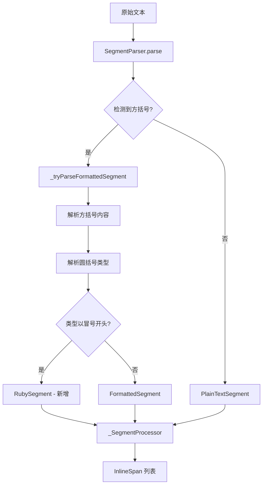

# 日文振假名（Ruby）支持实现方案

## 概述

本文档描述如何在现有的格式化文本系统中添加日文振假名（Ruby/振り仮名）支持。

### 目标语法

```
[漢](:かん)
```

- `[漢]` - 方括号内是基础文本（汉字）
- `(:かん)` - 圆括号内以冒号开头，后跟振假名读音

### 渲染效果

```
  かん
  漢
```

振假名以较小的字号显示在汉字上方。

---

## 现有架构分析

### 核心组件

1. **[`SegmentParser`](lib/components/rendering/formatted_text_parser.dart:463)** - 将文本解析为段落的解析器
2. **[`TypeParser`](lib/components/rendering/formatted_text_parser.dart:240)** - 解析类型字符串为样式信息
3. **[`_SegmentProcessor`](lib/components/rendering/formatted_text_parser.dart:842)** - 将段落转换为 `InlineSpan`

### 现有语法格式

```
[text](type1,type2)
```

- 方括号内是内容文本
- 圆括号内是逗号分隔的类型/样式标识符

### 解析流程



---

## 实现方案

### 方案选择

#### 方案A: WidgetSpan + Column（推荐）

使用 `WidgetSpan` 包装一个 `Column` Widget 来实现 Ruby 文本布局。

**优点：**

- 实现简单直观
- 布局精确可控
- 与现有 WidgetSpan 用法一致（如标签实现）

**缺点：**

- 会打断文本选择连续性
- 复制文本时可能丢失振假名信息

**实现示例：**

```dart
WidgetSpan(
  alignment: PlaceholderAlignment.middle,
  child: Column(
    mainAxisSize: MainAxisSize.min,
    children: [
      Text(
        'かん',
        style: TextStyle(fontSize: baseFontSize * 0.5),
      ),
      Text(
        '漢',
        style: baseStyle,
      ),
    ],
  ),
)
```

#### 方案B: 纯 TextSpan 方案

尝试使用 `TextSpan` 的嵌套和样式来实现。

**优点：**

- 保持文本选择连续性

**缺点：**

- Flutter 的 TextSpan 不原生支持 Ruby 布局
- 需要复杂的自定义渲染
- 实现难度高

#### 方案C: CustomPaint 自定义渲染

使用 `CustomPaint` 完全自定义渲染。

**优点：**

- 完全控制渲染效果

**缺点：**

- 实现最复杂
- 维护成本高
- 文本选择需要额外处理

### 推荐方案：方案A

考虑到：

1. 项目中已广泛使用 `WidgetSpan`（如标签、图标等）
2. 实现复杂度可控
3. 日文词典场景下，文本选择连续性不是核心需求

推荐采用 **方案A: WidgetSpan + Column**。

---

## 详细实现步骤

### 步骤1: 新增 Ruby 段落类型

在 [`formatted_text_parser.dart`](lib/components/rendering/formatted_text_parser.dart) 中新增 `RubySegment` 类：

```dart
/// 振假名段落
class _RubySegment extends _ParsedSegment {
  final String baseText;    // 基础文本（汉字）
  final String rubyText;    // 振假名

  const _RubySegment(this.baseText, this.rubyText);

  @override
  String get textContent => baseText;

  @override
  R accept<R>(_SegmentVisitor<R> visitor) => visitor.visitRuby(this);
}
```

### 步骤2: 扩展 Visitor 接口

在 `_SegmentVisitor` 中添加 `visitRuby` 方法：

```dart
abstract class _SegmentVisitor<R> {
  R visitPlain(_PlainTextSegment segment);
  R visitFormatted(_FormattedSegment segment);
  R visitRuby(_RubySegment segment);  // 新增
}
```

### 步骤3: 修改解析逻辑

在 [`SegmentParser._tryParseFormattedSegment`](lib/components/rendering/formatted_text_parser.dart:499) 中添加 Ruby 语法检测：

```dart
static _ParsedSegment? _tryParseFormattedSegment(_ParseContext ctx) {
  // ... 现有代码 ...

  final content = contentResult;
  final typesStr = typesResult;

  // 检测 Ruby 语法: [text](:ruby)
  if (typesStr.startsWith(':')) {
    final rubyText = typesStr.substring(1);
    return _RubySegment(content, rubyText);
  }

  // ... 现有格式化段落处理 ...
}
```

### 步骤4: 实现 Ruby 渲染

在 [`_SegmentProcessor`](lib/components/rendering/formatted_text_parser.dart:842) 中添加 Ruby 处理方法：

```dart
@override
void visitRuby(_RubySegment segment) {
  final fontSize = baseStyle.fontSize ?? kDefaultFontSize;

  spans.add(
    WidgetSpan(
      alignment: PlaceholderAlignment.middle,
      child: _buildRubyWidget(
        baseText: segment.baseText,
        rubyText: segment.rubyText,
        baseStyle: baseStyle,
        rubyFontSize: fontSize * kRubyFontScale,
      ),
    ),
  );
  plainTexts.add(segment.baseText);
}

Widget _buildRubyWidget({
  required String baseText,
  required String rubyText,
  required TextStyle baseStyle,
  required double rubyFontSize,
}) {
  return Column(
    mainAxisSize: MainAxisSize.min,
    crossAxisAlignment: CrossAxisAlignment.center,
    children: [
      Text(
        rubyText,
        style: baseStyle.copyWith(
          fontSize: rubyFontSize,
          height: 1.0,
        ),
      ),
      SizedBox(height: 1),  // 可选的间距
      Text(
        baseText,
        style: baseStyle,
      ),
    ],
  );
}
```

### 步骤5: 添加常量配置

在常量区域添加 Ruby 相关配置：

```dart
/// 振假名字号缩放比例
const double kRubyFontScale = 0.5;

/// 振假名与基础文本之间的间距
const double kRubySpacing = 1.0;
```

### 步骤6: 更新 removeFormatting 函数

修改 [`removeFormatting`](lib/components/rendering/formatted_text_parser.dart:597) 函数以正确处理 Ruby 语法：

```dart
String removeFormatting(String text) {
  // 先处理 Ruby 语法: [漢](:かん) -> 漢
  String result = text.replaceAllMapped(
    RegExp(r'\[([^\]]*?)\]\(:[^\)]*?\)'),
    (match) => match.group(1) ?? '',
  );

  // 再处理普通格式化语法
  result = result.replaceAllMapped(
    _removeFormattingPattern,
    (match) => match.group(1) ?? '',
  );

  return result;
}
```

---

## 文件修改清单

| 文件                                                                                                         | 修改内容                               |
| ------------------------------------------------------------------------------------------------------------ | -------------------------------------- |
| [`lib/components/rendering/formatted_text_parser.dart`](lib/components/rendering/formatted_text_parser.dart) | 主要修改文件，添加 Ruby 解析和渲染逻辑 |
| [`README.md`](README.md)                                                                                     | 更新文档，添加 Ruby 语法说明           |

---

## 测试用例

### 解析测试

```dart
test('解析 Ruby 语法', () {
  const text = '[漢](:かん)';
  final ctx = _ParseContext(text);
  final segments = SegmentParser.parse(ctx);

  expect(segments.length, 1);
  expect(segments[0], isA<_RubySegment>());

  final ruby = segments[0] as _RubySegment;
  expect(ruby.baseText, '漢');
  expect(ruby.rubyText, 'かん');
});
```

### 渲染测试

```dart
testWidgets('渲染 Ruby 文本', (tester) async {
  await tester.pumpWidget(
    MaterialApp(
      home: Scaffold(
        body: Text.rich(
          parseFormattedText(
            '[漢](:かん)',
            TextStyle(fontSize: 20),
          ).spans.first as InlineSpan,
        ),
      ),
    ),
  );

  // 验证 WidgetSpan 存在
  expect(find.byType(Column), findsOneWidget);
});
```

### 混合文本测试

```dart
test('解析混合文本', () {
  const text = '这是[漢](:かん)字测试';
  final ctx = _ParseContext(text);
  final segments = SegmentParser.parse(ctx);

  expect(segments.length, 3);
  expect(segments[0], isA<_PlainTextSegment>());
  expect(segments[1], isA<_RubySegment>());
  expect(segments[2], isA<_PlainTextSegment>());
});
```

---

## 扩展考虑

### 1. 多字符振假名

支持一个汉字对应多个假名的情况：

```
[明日](:あした)
```

渲染效果：

```
  あした
  明日
```

当前方案已支持此场景，无需额外修改。

### 2. 美化样式

可以考虑添加以下可选配置：

- 振假名字体样式（如颜色、字重）
- 振假名位置（上方/下方，用于某些特殊排版）
- 振假名与基础文本的对齐方式

### 3. 性能优化

对于大量 Ruby 文本的场景，可以考虑：

- 缓存 Ruby Widget
- 使用 `const` 构造函数

---

## 实现优先级

1. **P0 - 核心功能**
    - Ruby 语法解析
    - 基本渲染实现

2. **P1 - 文档更新**
    - README 语法说明
    - 代码注释

3. **P2 - 可选增强**
    - 样式配置
    - 性能优化

---

## 总结

本方案通过扩展现有的格式化文本解析器，以最小的代码改动实现日文振假名支持。核心思路是：

1. 新增 `_RubySegment` 段落类型
2. 在解析阶段识别 `(:...)` 语法
3. 使用 `WidgetSpan` + `Column` 实现 Ruby 布局

该方案与现有架构高度兼容，实现复杂度可控，适合快速迭代开发。
